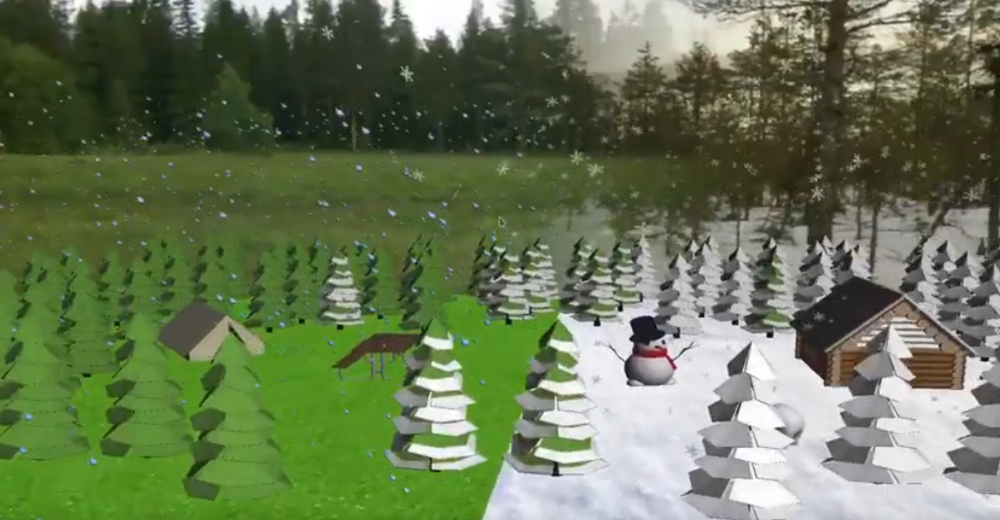

# POGL

Project realized by Sabine Hu and Pierre Guillaume.

## Results




## Usage
```shell
./cmakebuild.sh
./build/opengl [width] [height]
```

Default window size is 800x600

## Keyboard shortcuts
* W: move forward
* S: move backward
* A: move left
* D: move right
* Page up: increase movement speed
* Page down: decrease movement speed
* N: set wireframe mode to GL\_FILL
* M: set wireframe mode to GL\_LINE
* B: enable bubble effect
* V: disable bubble effect
* Space / escape: close the window

## Links
* Technique: https://youtu.be/-4xZov_LaPM
* Demo: https://youtu.be/hB8OFUmi0TE
